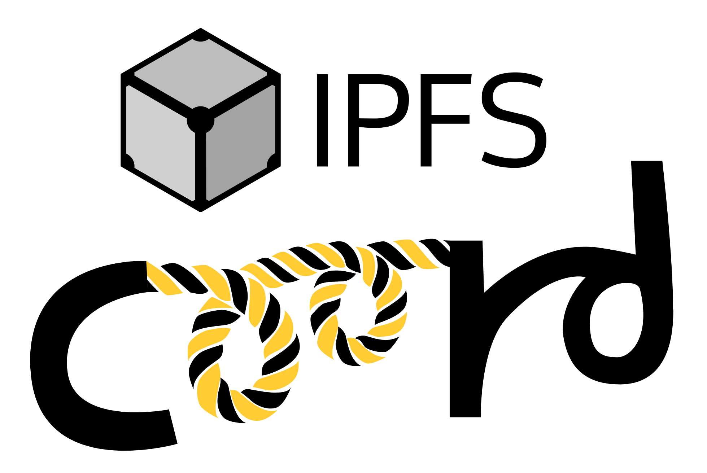

# ipfs-coord

This is a JavaScript npm library built on top of [js-ipfs](https://github.com/ipfs/js-ipfs). It provides the following high-level features:

- **Subnets** - Helps IPFS nodes create an on-the-fly subnetwork, using pubsub channels.
- **Peer Discovery** - Allows new peers entering the subnetwork to find the other subnetwork peers.
- **E2EE** - Creates end-to-end encrypted (e2ee) communication channels between peers.
- **Censorship Resistance** - Allows automatic networking between peers, even if they are behind a firewall.
- **Payments** - Allows peers to easily pay one another in cryptocurrency for access to web services.

This library will help IPFS peers discover one another, coordinate around a common interest, and then stay connected around that interest. It's main sub-components are:

- IPFS pubsub channels for communication
- OrbitDB for persistence and to prevent 'dropped messages'
- Circuit Relays for censorship resistance and tunneling through firewalls
- Bitcoin Cash for end-to-end encryption and payments.

This library will automatically track peers, connects to them through circuit-relays, and end-to-end encrypts all communication with each node.

Here are some use cases where IPFS node coordination is needed:

- e2e encrypted chat
- Circuit-relay as-a-service
- Creating CoinJoin transactions
- Decentralized exchange of currencies
- Compute-as-a-service
- Storage-as-a-service

The ultimate goal for this library is to be a building block for building a replacement to the conventional REST API. APIs like REST or gRPC are incredibly valuable, but suffer from the same censorship risks as the rest of the web. An IPFS-based API, in a fully distributed network like IPFS, must have sophisticated coordination in order for it to function properly. This is that coordination library.

Here is some videos and blog posts that preceded this work:

- Demo video 1: [Demo of chat.fullstack.cash](https://youtu.be/zMklhvq_NFM)
- Demo video 2: [ipfs-coord Architecture](https://youtu.be/jUFY7hM1xpk)

Additional content that preceded this work:

- [Building Uncensorable REST APIs](https://youtu.be/VVc0VbOD4co)
- [IPFS API](https://troutsblog.com/blog/ipfs-api)
- [Introducing chat.fullstack.cash](https://troutsblog.com/blog/chat-fullstack-cash)
- [UncensorablePublishing.com](https://uncensorablepublishing.com)
- [PS004 Collaborative CoinJoin](https://github.com/Permissionless-Software-Foundation/specifications/blob/master/ps004-collaborative-coinjoin.md)

A live demo of using this library to build an e2e encrypted chat app can be interacted with here:

- [chat.fullstack.cash](https://chat.fullstack.cash)

## Install

Install the npm library:
`npm install --save ipfs-coord`

This library requires a _peer_ dependency of:

- [@psf/bch-js](https://www.npmjs.com/package/@psf/bch-js)
- [ipfs](https://www.npmjs.com/package/ipfs) (version 0.55.4 or _lower_)

### Example in a node.js app:

Here is an example of adding ipfs-coord to your own node.js app:

```javascript
const IPFS = require('ipfs')
const BCHJS = require('@psf/bch-js')
const IpfsCoord = require('ipfs-coord')

async function start() {
  // Create an instance of bch-js and IPFS.
  const bchjs = new BCHJS()
  const ipfs = await IPFS.create()

  // Pass bch-js and IPFS to ipfs-coord when instantiating it.
  const ipfsCoord = new IpfsCoord({
    ipfs,
    bchjs,
    type: 'node.js'
  })

  await ipfsCoord.start()
  console.log('IPFS and the coordination library is ready.')
}
start()
```

### Example in a browser app:

This example is exactly the same, except when instantiating the ipfs-coord library, you want to specify the `type` as `browser`.

```javascript
import IPFS from 'ipfs'
import BCHJS from '@psf/bch-js'
import IpfsCoord from 'ipfs-coord'

async function start() {
  // Create an instance of bch-js and IPFS.
  const bchjs = new BCHJS()
  const ipfs = await IPFS.create()

  // Pass bch-js and IPFS to ipfs-coord when instantiating it.
  const ipfsCoord = new IpfsCoord({
    ipfs,
    bchjs,
    type: 'browser'
  })

  await ipfsCoord.start()
  console.log('IPFS and the coordination library is ready.')
}
start()
```

### Development Environment

Setup a development environment:

```
git clone https://github.com/christroutner/ipfs-coord
cd ipfs-coord
npm install
npm test
```

# Licence

[MIT](LICENSE.md)

t
